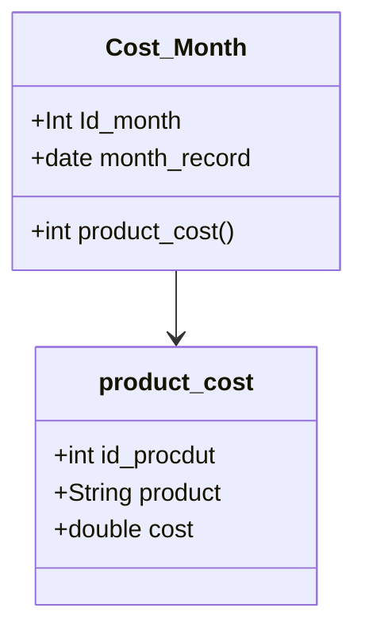

# App Cost

Esta es una aplicación móvil diseñada para ofrecer una solución sencilla y rápida para el control financiero personal, enfocada en el seguimiento de gastos del día a día. Su objetivo principal es permitir al usuario capturar y revisar de forma eficiente los costos asociados a los productos que consume a diario

## functionalidad
Registro de Gastos Simples: La función central de la aplicación permite al usuario registrar una nueva transacción de gasto con la mínima cantidad de pasos.

Anotación Detallada: Por cada registro, la aplicación captura dos datos esenciales:

    Producto/Categoría: El nombre del artículo o servicio adquirido.

    Costo: El monto exacto gastado en esa transacción.

Revisión y Control:  El usuario puede revisar su historial de gastos para analizar los patrones de consumo. La aplicación permitirá consultas sencillas para visualizar:

    Los gastos totales por día, semana o mes.

    El detalle de los productos comprados y sus costos a lo largo del tiempo.
##  Modelo de Base de Datos

